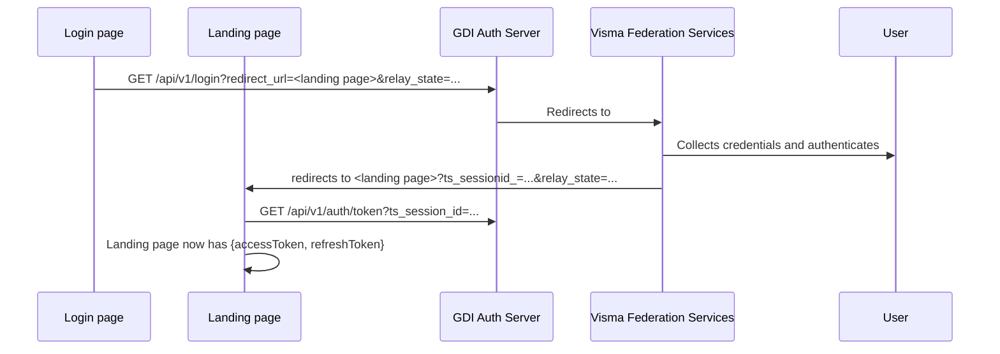

<!-- Improved compatibility of back to top link: See: https://github.com/othneildrew/Best-README-Template/pull/73 -->
<a name="readme-top"></a>
<!--
*** Thanks for checking out the Best-README-Template. If you have a suggestion
*** that would make this better, please fork the repo and create a pull request
*** or simply open an issue with the tag "enhancement".
*** Don't forget to give the project a star!
*** Thanks again! Now go create something AMAZING! :D
-->


<!-- PROJECT SHIELDS -->
<!--
*** I'm using markdown "reference style" links for readability.
*** Reference links are enclosed in brackets [ ] instead of parentheses ( ).
*** See the bottom of this document for the declaration of the reference variables
*** for contributors-url, forks-url, etc. This is an optional, concise syntax you may use.
*** https://www.markdownguide.org/basic-syntax/#reference-style-links
-->
[![MIT License][license-shield]][license-url]

<p>
  <a href="https://github.com/helsingborg-stad/gdi-auth-server">
    
  </a>
</p>
<h1>GDI Authentication Server</h1>
<p>
  <br />
  <a href="https://github.com/helsingborg-stad/gdi-auth-server/issues">Report Bug</a>
  ·
  <a href="https://github.com/helsingborg-stad/gdi-auth-server/issues">Request Feature</a>
</p>


# 

<!-- TABLE OF CONTENTS -->
<details>
  <summary>Table of Contents</summary>
  <ol>
    <li>
      <a href="#about-the-project">About The Project</a>
    </li>
    <li>
      <a href="#authentication-flow">Authentication flow</a>
    </li>
    <li>
      <a href="#getting-started">Getting Started</a>
      <ul>
        <li><a href="#prerequisites">Prerequisites</a></li>
        <li><a href="#configure-environment-variables">Configure environment variables</a></li>
        <li><a href="#run-locally">Run locally</a></li>
        <li><a href="#end-to-end-testing">End to end testing</a></li>
      </ul>
    </li>
    <li><a href="#roadmap">Roadmap</a></li>
    <li><a href="#contributing">Contributing</a></li>
    <li><a href="#license">License</a></li>
    <li><a href="#acknowledgments">Acknowledgments</a></li>
  </ol>
</details>


<!-- ABOUT THE PROJECT -->
## About The Project

Authentication using Visma Federation Services (BankId, Freya).

<p align="right">(<a href="#readme-top">back to top</a>)</p>

## Authentication flow
A website that want's to autenticate an interactive user should provide
- a login page with a (web) link to __/api/v1/auth/login__ providing
- a landing page that will collect access and refresh tokens from __/api/v1/auth/token__




<p align="right">(<a href="#readme-top">back to top</a>)</p>

<!-- GETTING STARTED -->
## Getting Started

### Prerequisites

- [nodejs](https://nodejs.org/en/)
- [Yarn](https://classic.yarnpkg.com/lang/en/docs/install)

<p align="right">(<a href="#readme-top">back to top</a>)</p>

### Configure environment variables

In order to run, some environment variables must be defined. This is easiest to do by
- ensuring there exists a local `.env` in the project root
- copy content from [.env.example](.env.example) and change values to what gives meaning

<p align="right">(<a href="#readme-top">back to top</a>)</p>

### Run locally
```sh
# install dependencies
yarn
# run tests
yarn test
# run tests and report coverage
yarn coverage
# start web server
yarn start
# start server on port 400 instead of default 3000
PORT=4000 yarn start
# start with debugging output
DEBUG=* yarn start
```
<p align="right">(<a href="#readme-top">back to top</a>)</p>

### End to end testing

Navigate to 
http://localhost:3000/api/v1/auth/login?redirect_url=http://localhost:3000/api/v1/auth/test-landing-page. 
It should take you through the authenticationprocess and in the end present issued __access__ and __refreh__ tokens.

<p align="right">(<a href="#readme-top">back to top</a>)</p>

## Roadmap

- [x] Authenticate against Visma (BankId, Freja)
- [x] issue JWT access tokens and refresh tokens
- [ ] access token reneval
- [ ] handle refresh token validity
- [ ] handle refresh token revocation

<p align="right">(<a href="#readme-top">back to top</a>)</p>


<!-- CONTRIBUTING -->
## Contributing

Contributions are what make the open source community such an amazing place to learn, inspire, and create. Any contributions you make are **greatly appreciated**.

If you have a suggestion that would make this better, please fork the repo and create a pull request. You can also simply open an issue with the tag "enhancement".
Don't forget to give the project a star! Thanks again!

1. Fork the Project
2. Create your Feature Branch (`git checkout -b feature/AmazingFeature`)
3. Commit your Changes (`git commit -m 'Add some AmazingFeature'`)
4. Push to the Branch (`git push origin feature/AmazingFeature`)
5. Open a Pull Request

<p align="right">(<a href="#readme-top">back to top</a>)</p>


<!-- LICENSE -->
## License

Distributed under the MIT License. See [LICENSE](LICENSE) for more information.

<p align="right">(<a href="#readme-top">back to top</a>)</p>


<!-- ACKNOWLEDGMENTS -->
## Acknowledgments

* [gdi-template](https://github.com/helsingborg-stad/gdi-template)
* [Best-README-Template](https://github.com/othneildrew/Best-README-Template)

<p align="right">(<a href="#readme-top">back to top</a>)</p>


<!-- MARKDOWN LINKS & IMAGES -->
<!-- https://www.markdownguide.org/basic-syntax/#reference-style-links -->
[license-shield]: https://img.shields.io/github/license/helsingborg-stad/gdi-template.svg?style=for-the-badge
[license-url]: https://github.com/helsingborg-stad/gdi-template/blob/master/LICENSE.txt
